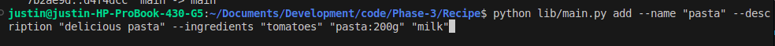
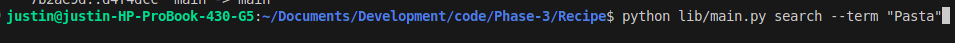
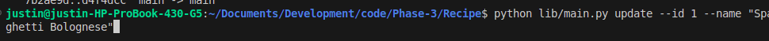
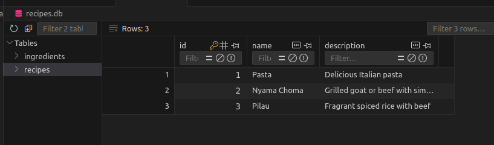
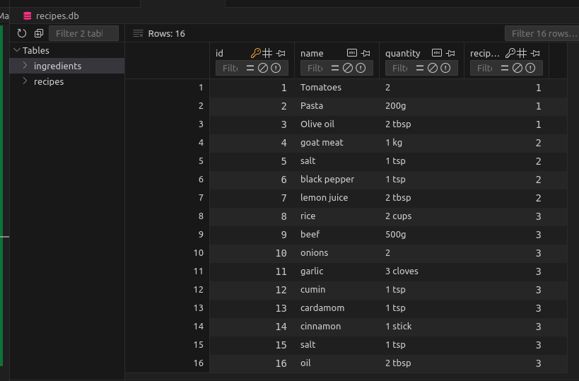

# Recipe-Manager
# Recipe Manager CLI

The **Recipe Manager CLI** is a Python-based command-line application designed to help you manage recipes and their ingredients easily. You can add, update, delete, and search for recipes with a simple and user-friendly interface. The project utilizes SQLAlchemy for database management and provides a simple interface for interacting with your recipe collection.

---

## Table of Contents
1. [Features](#features)
2. [Installation](#installation)
3. [Usage](#usage)
   - [Adding a Recipe](#adding-a-recipe)
   - [Updating a Recipe](#updating-a-recipe)
   - [Deleting a Recipe](#deleting-a-recipe)
   - [Searching for Recipes](#searching-for-recipes)
4. [Screenshots](#screenshots)
5. [Database Structure](#database-structure)
6. [Contributing](#contributing)
7. [License](#license)

---

## Features

- **Add Recipes**: Insert a new recipe with multiple ingredients.
- **Update Recipes**: Modify an existing recipe's name, description, or ingredients.
- **Delete Recipes**: Remove unwanted recipes from the database.
- **Search Recipes**: Search for recipes by name or ingredient.
- **One-to-Many Relationships**: A recipe can have multiple ingredients.
- **User-Friendly CLI**: Simple and intuitive command-line interface.

---

## Installation

### Prerequisites
- Python 3.8 or higher
- SQLAlchemy
- SQLite (included in Python by default)

### Step-by-Step Installation

1. **Clone the Repository**
   
   Open your terminal and run the following command:

   ```bash
   git clone https://github.com/your-repo/recipe-manager-cli.git
   cd recipe-manager-cli
   # Recipe Manager CLI

## Usage

The Recipe Manager CLI can be used for managing recipes. Below are examples of how to use the application to add, update, delete, and search recipes.

### Screenshots

Below are some screenshots showing the usage of the Recipe Manager CLI.

### Adding a Recipe

In this screenshot, we are adding a recipe for Ugali using the `add` command.



### Searching for Recipes

This screenshot shows how the search functionality works by listing all recipes that match the search term "Pilau".



### Deleting a Recipe

Here, you can see the process of deleting a recipe by providing its ID.


### Updating A Recipe

Here, you can see the process of updating a recipe.




## Database Structure

The Recipe Manager CLI uses **SQLite** as its database, managed with **SQLAlchemy ORM**. The structure is as follows:

### Tables

- **Recipes**
  - `id` (Primary Key)
  - `name` (String)
  - `description` (Text)
  



- **Ingredients**
  - `id` (Primary Key)
  - `name` (String)
  - `quantity` (String)
  - `recipe_id` (Foreign Key referencing Recipes)




### Relationships

- A **Recipe** can have multiple **Ingredients** (One-to-Many relationship).

## Contributing

We welcome contributions from the community! If you'd like to contribute:

1. Fork the repository
2. Create a new branch for your feature or bug fix
3. Submit a pull request with detailed information about your changes

Please ensure your code follows the best practices and includes tests where appropriate.

## License

This project is licensed under the **MIT License**. Feel free to use and modify the code as per the terms of the license.
